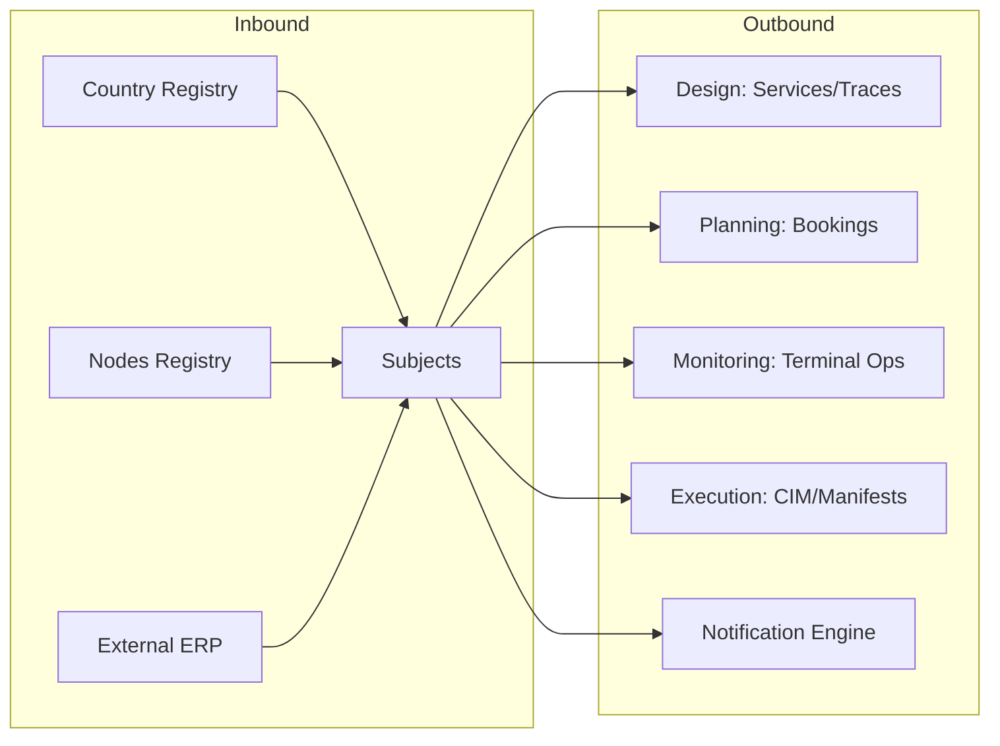

## 1. Overview
The **Subjects** (Soggetti) module is the foundational registry for all entities interacting with the platform. It serves as the single source of truth for identity, financial compliance, and operational roles.

Every booking, service, and asset must be linked to a valid Subject, making it the most critical data pillar of the system.

## 2. Core Functional Pillars

### 1. Identity & Compliance
Tracks the legal and fiscal metadata for each partner, including:
*   **Fiscal IDs**: EORI and P.IVA (VAT) codes.
*   **Categorization**: Defines if a subject is an Agente, MTO, Carrier (Vettore), or Terminal Operator (Terminalista).
*   **ERP Synchronization**: Automated syncing of codes (Customer/Supplier) with external financial systems. Last sync timestamps are visible in the header for transparency.

### 2. Personnel Registry (Contatti)
A 1:N relationship listing key personnel within each subject. Contacts are categorized by:
*   **Tipologia**: Booking, Administration, Operations.
*   **Ufficio**: Import, Export.
*   **Context**: Main Referent vs. Information Only.
This ensures operational notifications reach the correct departments automatically.

### 3. Service Authorization (Connessioni)
The connection matrix determines which specific service lines are available for a partner. This acts as a security gateway for collaboration, preventing unauthorized bookings for specific routes.

### 4. Infrastructure Mapping (Magazzini)
Links subjects to specific **Nodes** (Terminals/Stations), establishing ownership or stakeholder relationships. This enables features like **Storage Threshold Alerts** (Soglia stock).

## 3. Interaction Logic

- **Role-Based Filtering**: Checking a category (e.g., "Vettore") instantly makes that subject available in dropdowns throughout the platform (e.g., in the DESIGN module for Trace definition).
- **ERP Integration**: The system displays the `erp_codice_cliente` and `erp_codice_fornitore`, which are typically read-only fields synchronized from an external financial system to ensure data consistency.
- **Service Hub**: The "Connessioni" tab allows for granular enablement of service-connessione pairs for each subject, ensuring commercial agreements are enforced at the system level.

## 4. Data Connectivity

## 5. Field Mapping Reference

### Registry List (Gestione Soggetti)
| Field | Technical Name | Description |
| :--- | :--- | :--- |
| **Ragione Sociale** | `ragsoc` | Full legal name of the entity. |
| **Nome Breve** | `nomebreve` | Short moniker used in dashboards and lists. |
| **Categorie** | `categorie` | Tagged list of operational roles (Agente, MTO, etc). |
| **Ruoli** | `ruoli` | Commercial status (Prospect, Customer, Supplier). |
| **PIVA/CF** | `piva` / `cf` | VAT and Fiscal identification. |
| **Cod. Cliente** | `erp_codice_cliente` | Unique ID from the financial system (Client). |
| **Cod. Fornitore** | `erp_codice_fornitore` | Unique ID from the financial system (Supplier). |

### Form Detailed Sections (Nuovo Soggetto)

#### Anagrafica (Core Data)
- **Names**: `ragsoc` (Required), `nomebreve` (Required).
- **Address**: Full administrative and fiscal address including country codes (`paeseamministrativo`, `paesefiscale`).
- **Fiscal**: PIVA (VAT), CF (Fiscal Code), EORI Code.

#### Contatti (1:N)
| Field | Technical Name | Description |
| :--- | :--- | :--- |
| **Tipologia** | `contatto_tipo` | Booking, Administration, or Operations. |
| **Ufficio** | `contatto_ufficio` | Import or Export focus. |
| **Riferimento** | `contatto_contesto` | Referente (Main) vs Interessato (CC). |
| **Email** | `contatto_email` | Direct contact for automated triggers. |

#### Magazzini & Connessioni
- **Magazzini**: Links to the Nodes Registry via `magazzino_luogo`. Tracks ownership (`magazzino_is_proprietario`).
- **Connessioni**: Binary toggle (`1`/`0`) via `connessione[ID]` for every service-line available.
- **Transcodifiche**: External system IDs like `codice_edi` and `codice_uirr`.
