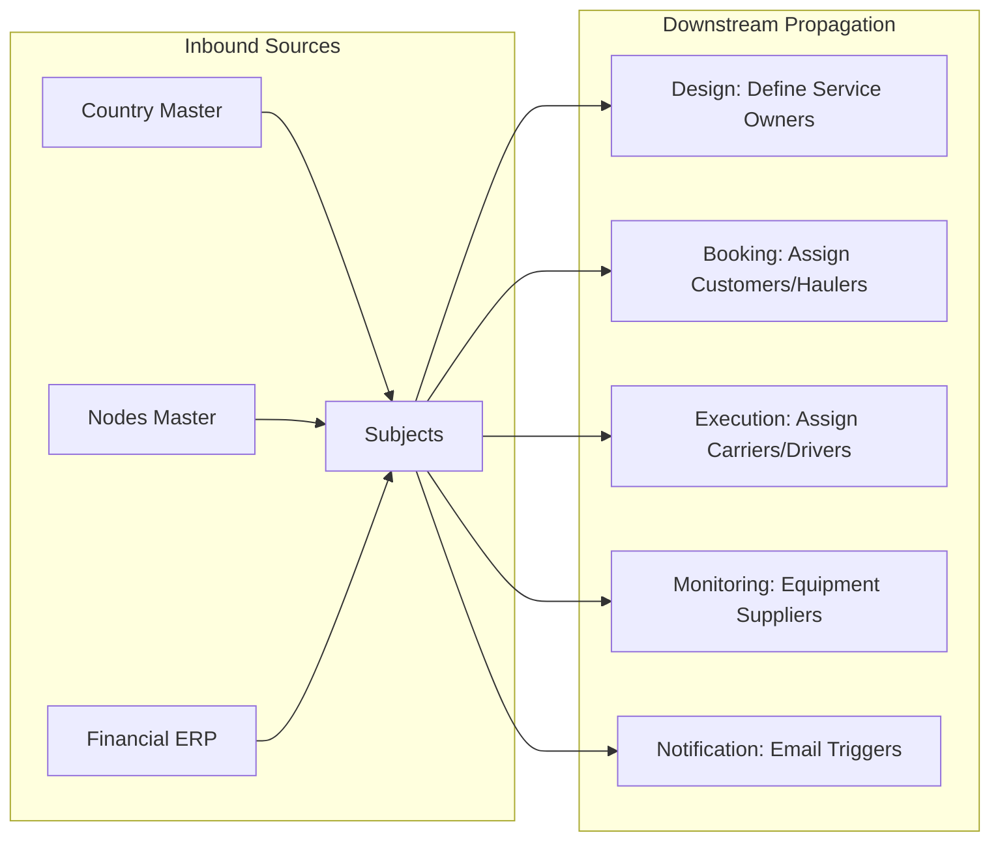

## 1. Overview
The **Subjects** (Soggetti) module is the foundational registry for all entities interacting with the platform. It serves as the single source of truth for identity, financial compliance, and operational roles.

Every booking, service, and asset must be linked to a valid Subject, making it the most critical data pillar of the system.

## 2. Core Functional Pillars

### 1. Identity & Compliance
Tracks the legal and fiscal metadata for each partner, including:
*   **Fiscal IDs**: EORI and P.IVA (VAT) codes.
*   **Categorization**: Defines if a subject is an Agente, MTO, Carrier (Vettore), or Terminal Operator (Terminalista).
*   **ERP Synchronization**: Automated syncing of codes (Customer/Supplier) with external financial systems. Last sync timestamps are visible in the header for transparency.

### 2. Personnel Registry (Contatti)
A 1:N relationship listing key personnel within each subject. Contacts are categorized by:
*   **Tipologia**: Booking, Administration, Operations.
*   **Ufficio**: Import, Export.
*   **Context**: Main Referent vs. Information Only.
This ensures operational notifications reach the correct departments automatically.

### 3. Service Authorization (Connessioni)
The connection matrix determines which specific service lines are available for a partner. This acts as a security gateway for collaboration, preventing unauthorized bookings for specific routes.

### 4. Infrastructure Mapping (Magazzini)
Links subjects to specific **Nodes** (Terminals/Stations), establishing ownership or stakeholder relationships. This enables features like **Storage Threshold Alerts** (Soglia stock).

## 3. Operational Logic & Data Security
The Subjects module is the "Identity Provider" for Magemo. It enforces business rules through several technical mechanisms:

### I. Role-Based Visibility
The system uses the `categorie` tags to drive UI availability. 
- If a subject is not tagged as **Vettore**, they will not appear in the **Execution > Rail** carrier selection dropdown.
- If a subject is not tagged as **Cliente**, they cannot be selected as the primary `id_soggetto` in a **Booking**.

### II. Financial Safeguards
By linking subjects to external ERP IDs (`erp_codice_cliente`), the system ensures that every booking is credited to a valid account. If a subject lacks an ERP code, the **Admin** module may flag their bookings as "Pro-forma" or block invoicing.

### III. Notification Resolution
The **Contatti** sub-registry is the engine for PDF dispatch. When a CIM or Manifest is generated, the system looks at the **Vettore** linked to the trip, finds its contacts with `Tipologia = Operations`, and automatically attaches them to the email queue.

## 4. Data Connectivity & Flow

## 5. Field Mapping Reference

### Registry List (Gestione Soggetti)
| Field | Technical Name | Source | Description |
| :--- | :--- | :--- | :--- |
| **Ragione Sociale** | `ragsoc` | Manual | Full legal name of the entity. |
| **Nome Breve** | `nomebreve` | Manual | Short moniker used in dashboards. |
| **Categorie** | `categorie` | Enum | Operational roles (Agente, MTO, etc). |
| **Ruoli** | `ruoli` | Enum | Commercial status (Prospect, Customer). |
| **Cod. Cliente** | `erp_codice_cliente` | **ERP** | Key for financial synchronization. |

### Form Detailed Sections (Nuovo Soggetto)

#### Anagrafica (Core Identity)
- **Names**: `ragsoc` (Required), `nomebreve` (Required).
- **Address**: Full administrative and fiscal address including country codes (`paeseamministrativo`, `paesefiscale`).
- **Fiscal**: PIVA (VAT), CF (Fiscal Code), EORI Code (Critical for customs).

#### Contatti (The Notification Registry)
| Field | Technical Name | Flow |
| :--- | :--- | :--- |
| **Tipologia** | `contatto_tipo` | Determines if they receive Bookings vs Invoices. |
| **Ufficio** | `contatto_ufficio` | Filters by Import/Export focus. |
| **Email** | `contatto_email` | The target for automated PDF delivery. |

#### Magazzini & Connessioni (Network Boundaries)
- **Magazzini**: Links to **Nodi** via `magazzino_luogo`. Tracks ownership relationships.
- **Connessioni**: Binary gateway (`1`/`0`) that enables or disables specific commercial service lines for this customer.
- **Transcodifiche**: External system IDs like `codice_edi` and `codice_uirr` used for inter-system handshakes.
