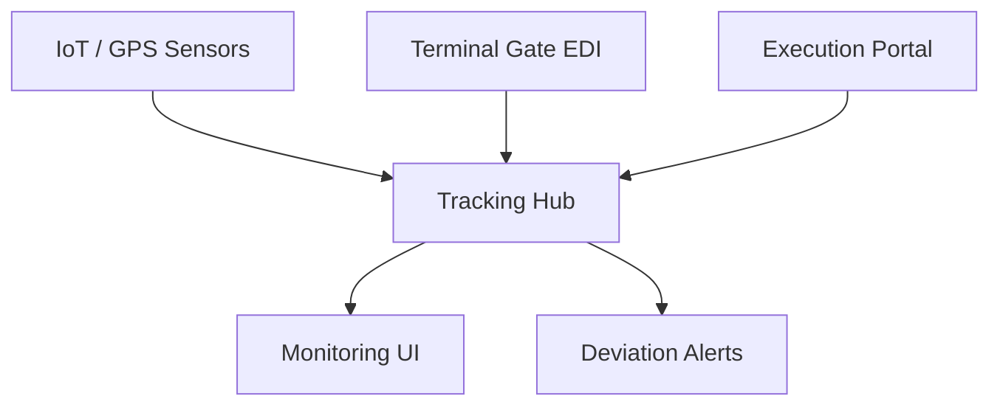

## 1. Overview
The **Equipment Monitoring** module provides a technical "Map" of all physical assets moving through the network. It tracks both the rail fleet (Wagons) and the intermodal cargo (UTIs).

## 2. Technical Field Mapping (Asset List)

### Rail Wagons (Vagoni)
| Field | Name | Description |
| :--- | :--- | :--- |
| **Matricola** | `wagon_code` | The 12-digit UIC identifier. |
| **Stato** | `status` | Operational availability (Green/Red). |
| **Stato Carico** | `load_status`| Binary indicator (Loaded / Empty). |
| **Posizione** | `position` | The sequence number within the train rake. |

### Intermodal Units (Equipment)
| Field | Name | Description |
| :--- | :--- | :--- |
| **Matricola** | `matricola` | Serial number (e.g., MSCU874563). |
| **Ultima Posizione**| `ultima_posizione`| The last validated GPS or Terminal event location. |
| **Ultimo Viaggio** | `ultimo_viaggio` | Reference to the current or last active Pratica. |
| **GPS** | `gps` | Signal health indicator (Online / Offline). |

## 3. Real-time Visibility

### Key Functionalities
*   **Geofencing**: Automated alerts when a wagon enters a designated maintenance or terminal zone.
*   **History Audit**: A breadcrumb trail of all physical locations recorded for a specific matricola across the last 30 days.
*   **Customer Visibility**: Real-time status sharing with clients via the Tracking API.
