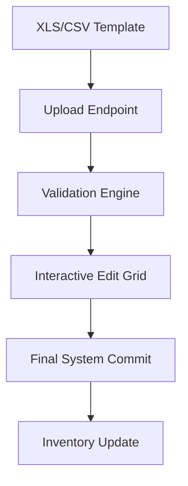

## 1. Overview
**Gate Operations** (Registrazione Ingressi/Uscite) is the physical interface between the terminal and the outside world. It handles the manual recording of equipment movements and supports high-volume batch ingestion for terminal shifts.

## 2. Technical Field Mapping (Manual Entry)

The gate system uses a high-density grid for recording unit arrivals and departures.

| Field | HTML Name | Nature | Description |
| :--- | :--- | :--- | :--- |
| **Codice UTI** | `js-autocomplete` | Dynamic | Real-time lookup from UTI master. |
| **Tipo Ingresso** | `id_tipo_movimento`| Select | Mode of arrival (Strada, Treno, Mare). |
| **Data Ingresso** | `data_ingresso` | Datepicker | Timestamp of physical gate event. |
| **Vuoto (Check)** | `flg_vuoto` | Checkbox | Commercial status of the arriving unit. |
| **Sigillo** | `sigillo` | Text | Mandatory if `flg_vuoto` is unchecked. |
| **HT / CER** | `flg_heavy/flg_cer`| Checkbox | Technical flags for safety and waste. |

## 3. Bulk Data Ingestion (Excel Import)

For high-volume terminals, the system supports a standardized Excel-based ingestion workflow.

### Operational Batch Processing
1.  **Template Download**: Operators use a predefined Excel template.
2.  **Drag-and-Drop**: The file is uploaded to the `/MTO/pages/inventario/entrata` page.
3.  **Conflict Resolution**: The system highlights missing data (e.g., unrecognized UTI codes) in the interactive grid for manual correction.
4.  **Verification**: Once all rows are "Green", the operator confirms the batch, which immediately updates the **Terminal Inventory**.

## 4. Connectivity & Business Logic
*   **Safety Interlocks**: Marked containers (e.g., UNDG/Hazardous) require secondary technical verification before they can be released from the gate.
*   **Booking Link**: Successfully checked-in units are automatically associated with their respective **Bookings**, allowing the **Planning** module to verify that the cargo is physically present for the next train leg.
*   **Execution Link**: Real-time gate-in signals trigger the update of the **Global Track & Trace** milestones.
