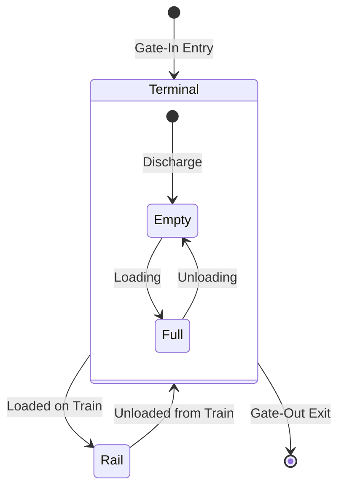

## 1. Overview
The **Inventory** sub-module (Inventario UTI) provides a real-time view of all physical Intermodal Units (UTIs) currently residing within the network terminals. It is the primary tool for Yard Managers to verify stock levels and identify dwelling units for commercial release or repositioning.

## 2. Technical Field Mapping (Asset List)

The inventory is divided into **Pieni** (Full) and **Vuoti** (Empty) registries.

| Field | HTML Name | Description |
| :--- | :--- | :--- |
| **Codice UTI** | `codice_uti` | Serial number of the container/tank. |
| **Tipo UTI** | `id_tipo_uti` | Category lookup (e.g., 40' HC, Tank). |
| **Locazione** | `id_nodo` | Current terminal where the unit is dwelling. |
| **Stato** | `uti.stato` | Commercial status (Full, Empty, Blocked). |
| **Ultimo Mov.** | `movimento.tipo`| The last recorded event (Entrata, Uscita). |

## 3. Unit Lifecycle & State Transitions

The system tracks the physical and commercial state of every unit as it moves through the network.

### Manual Corrections (Ingressi/Uscite)
While most status changes are triggered by execution manifests (Rail Planning), operators can manually register movements:
*   **Manual Gate-In**: Recording a unit's arrival from a road hauler.
*   **Manual Gate-Out**: Recording a unit's departure to a road hauler or specialized shunting.

## 4. Connectivity & Business Logic
*   **Equipment Link**: Every unit in inventory must exist in the **Equipment Registry** (GENERALE).
*   **Invoicing (Soste)**: The duration between a `Gate-In` and `Gate-Out` event for a specific terminal is used by the **Admin** module to calculate storage costs (Soste).
*   **Planning Link**: Only units with a status of `In Terminal` and `Ready` can be assigned to new train bookings in the **Rail Planning** interface.
