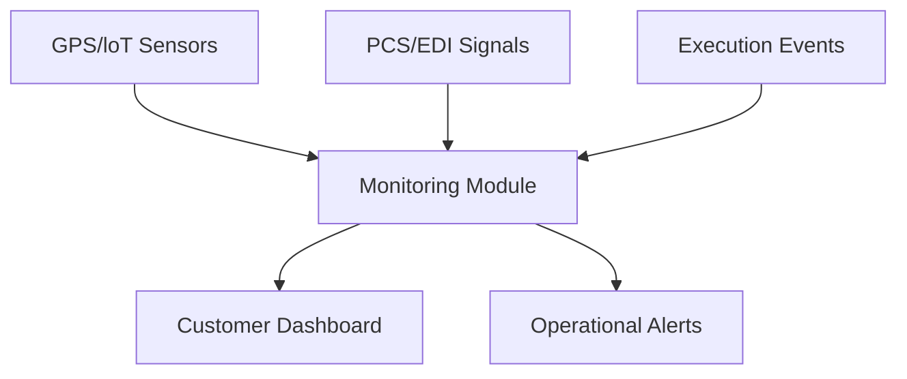

## 1. Overview
The **Track & Trace** system provides a unified visibility layer across the entire multimodal chain. It aggregates planned baselines from **Planning** and real-time events from **Execution** to provide a "single pane of glass" for operations and customer service.

## 2. Technical Field Mapping

### Rail Monitoring
Tracks the movement of train voyages (Pratiche) and their adherence to the schedule.

| Field | Source | Description |
| :--- | :--- | :--- |
| **Pratica** | Planning | Unique trip identifier and link to details. |
| **ETA (Est. Arrival)** | Schedule | The baseline arrival time from the design. |
| **ATA (Act. Arrival)** | Execution/GPS | The real-time arrival signal from the carrier. |
| **Status** | Logic | Current voyage state (In Transit, Arrived, etc.). |

### Trucking Monitoring
Tracks the progress of first and last-mile road missions.

| Field | Source | Description |
| :--- | :--- | :--- |
| **Trasportatore** | Subjects | The road carrier assigned to the leg. |
| **Targa** | Manual/App | The vehicle license plate for the mission. |
| **Rif. UTI** | Booking | The physical container linked to the road leg. |
| **Status** | Driver App | Inviato, Caricato, or Consegnato. |

### Order Monitoring (Mandati)
A customer-centric view tracking the end-to-end progress of a shipment.

| Field | Source | Description |
| :--- | :--- | :--- |
| **Cod. Mandato** | Booking | The master order identifier. |
| **Stato Avanzamento** | Aggregation | Current stage (e.g., Sbarcato, In Treno, Consegnato). |
| **Data Prevista** | Planning | The original delivery baseline for planning. |

## 3. Data Visibility Architecture

### Event Logic
Milestones are triggered by physical events in the network:
*   **Gate-In**: Registered in **Monitoring (Gate Ops)**, triggers the "Arrived at Terminal" milestone.
*   **Train Dispatch**: Registered in **Execution (Rail)**, triggers the "In Transit" milestone.
*   **Proof of Delivery (POD)**: Collected via the **Driver App**, triggers the "Delivered" status.

## 4. Connectivity & Impact
*   **Inbound**: Pulls the planned schedule from **PLANNING (Rail Planning)** and hauler assignments from **PLANNING (Booking)**.
*   **Outbound**: Feeds the **ADMIN** module for service level agreement (SLA) reporting and performance analysis, calculating the variance between "Planned" and "Actual" timestamps.
