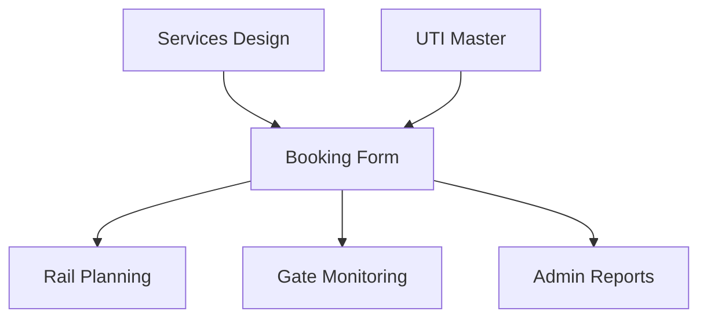

## 1. Overview
**Booking Management** is the commercial entry point of the platform. It translates a customer's transport request into a structured system record. Every booking links a **Client** to a specific **Service** and defines the physical **UTIs** and **Cargo** involved.

## 2. Technical Field Mapping (Nuovo Booking)

The booking form is a complex multi-tab interface designed for high-density data entry.

### Header & References
| Field | HTML Name | Nature | Source |
| :--- | :--- | :--- | :--- |
| **Cliente** | `id_soggetto` | Autocomplete | **Generale > Soggetti** |
| **Connessione** | `id_connessione` | Select | **Design > Connessioni** |
| **Data Servizio** | `data_slot` | Datepicker | Operational Calendar |
| **Rif. Cliente** | `rif_cliente` | Text | Manual Entry |

### Search & Filters (Gestione Booking)
The list view provides cross-modular filtering for commercial and operational tracking.

| Filter Label | Technical Name | Source Data (ID) | Created In | Flow/Logic |
| :--- | :--- | :--- | :--- | :--- |
| **Servizio** | `id_servizio` | `servizi` | **DESIGN > Servizi** | Commercial service line filtering. |
| **Connessione** | `id_connessione` | `connessioni` | **DESIGN > Connessioni** | Specific route filtering. |
| **Tipo UTI** | `id_tipo_uti` | `tipi_uti` | **GENERALE > UTI** | Filters by equipment class. |
| **Cliente** | `id_cliente` | `soggetti` | **GENERALE > Soggetti** | Filtered by Role: *Cliente*. |
| **Trasportatore** | `id_vettore` | `soggetti` | **GENERALE > Soggetti** | Filtered by Role: *Trasportatore*. |
| **Stato Booking** | `stato_booking` | `stati_booking` | **System State Machine** | Commercial status of the order. |

### Functional Tabs

#### UTI (Units)
Defines the physical equipment. Each booking can contain multiple UTI rows.
*   **Tipo UTI**: Selection from the technical equipment registry (`id_tipo_uti`).
*   **Matricola**: Autocomplete lookup for individual units in the fleet.
*   **Hazard Flags**: Toggles for **ADR/RID** (Dangerous Goods) and **CER** (Waste), triggering document requirements.

#### Merci (Goods)
Detailed cargo specification for customs and safety.
*   **Descrizione Merce**: Autocomplete lookup from the system's Goods database.
*   **Codice HS**: Automated or manual entry of Harmonized System codes.
*   **Net/Gross Weights**: Critical inputs that drive the train composition's weight validation.

#### Trucking (Road Legs)
Configures the first and last-mile pickup/delivery.
*   **Fornitore**: Selecting the hauler from the Subjects registry.
*   **Missions**: Defines whether the leg is for specialized transport or standard positioning.

#### Prestazioni (Services)
Management of accessory services (e.g., weighing, storage, customs). Linkage of costs and revenues directly to the booking record.

## 3. The Status Matrix (Visual Indicators)
The Booking table uses a "Diamond Matrix" to represent sub-module readiness at a glance:

1.  **BK (Booking)**: Commercial confirmation status.
2.  **TR (Train)**: Rail planning and execution status.
3.  **TT (Truck)**: Trucking dispatch status.
4.  **DO (Doc)**: Mandatory documentation status.

**Color Logic**:
- 

 **Green**: Complete / Dispatched.

- 

 **Yellow**: Pending / Planned.

- 

 **Red**: Problem / Rejected.

- 

 **Gray**: Not applicable.

## 4. Data Flow Architecture

*   **Inbound**: Pulls service templates from **DESIGN** and master registries from **GENERALE**.
*   **Outbound (Planning)**: Confirmed bookings appear as "Units to Load" in the Rail Planning Tetris view.
*   **Outbound (Operations)**: Trucking details generate "Gate Missions" for the terminal's entrance monitoring.
*   **Outbound (Finance)**: Weight and performance data feed the Tonnage reports in **ADMIN**.

## 5. Operational Control
Bookings are governed by a status lifecycle. A booking can only be "Scheduled" on a train if it has passed all technical validations (e.g., unit weights vs. wagon capacity) and its status is set to **Confirmed**.

