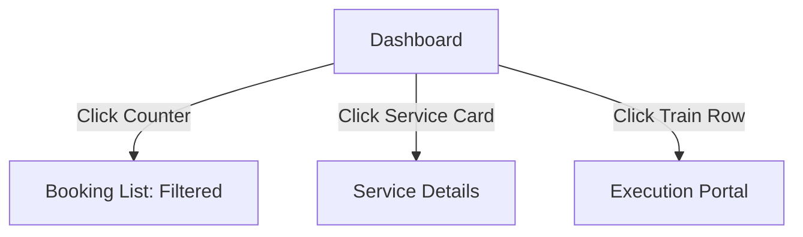

## 1. Overview
The **Planning Dashboard** is the primary entry point for logistics operators. It provides a real-time, high-level summary of the network's commercial intake and operational output.

## 2. Operational KPIs
The dashboard displays four critical counters driven by real-time database queries:

| Counter | Metric | Technical Source |
| :--- | :--- | :--- |
| **Booking Inseriti** | Volume | Count of records in `MAGEMO_BOOKINGS` created today. |
| **Da Pianificare** | Backlog | Bookings with status `DRAFT` or `PENDING`. |
| **Confermati** | Readiness | Bookings flagged as `CONFIRMED`. |
| **Unità in Partenza**| Throughput| Sum of Full/Empty units on trains departing today. |

## 3. Daily Rail Schedule
The dashboard provides a consolidated view of today's movements.

### Arrivi & Partenze (Pratiche)
| Field | Name | Description |
| :--- | :--- | :--- |
| **Viaggio** | `viaggio` | The unique train trip identifier. |
| **ETD / ETA** | `etd` / `eta` | Expected Time of Departure/Arrival. |
| **Pieni / Vuoti** | `pieni` / `vuoti`| Count of Full vs Empty intermodal units. |
| **Status** | `status` | Semaphore indicator (Green/Red/Amber) for delays. |

## 4. Interaction Flow

### Direct Actions
*   **Trip Monitoring**: Planners can jump directly into the loading list of a departing train to verify final container assignments.
*   **Service Health**: Visual "Service Cards" highlight how many bookings are assigned to each major corridor (e.g., Trieste-Munich).
