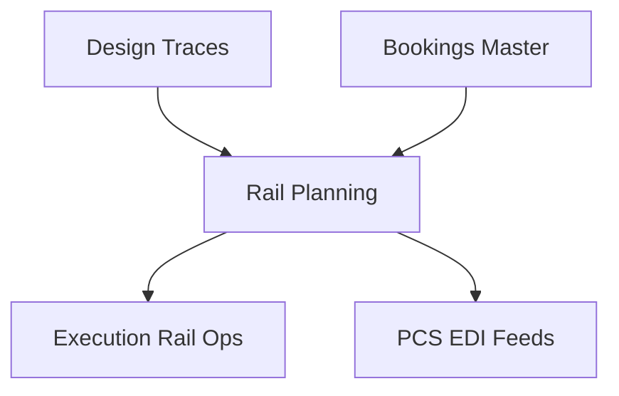

## 1. Overview
**Rail Planning** is the strategic interface for train construction. It provides operators with the tools to translate commercial bookings into technically feasible and safe rail compositions.

## 2. Technical Field Mapping (Elenco Treni)

The departures/arrivals list serves as the primary dashboard for rail coordinators.

### Search & Filters
| Label | HTML Name | Nature | Data Source |
| :--- | :--- | :--- | :--- |
| **Connessione** | `id_connessione` | Select | **Design > Connessioni** |
| **Viaggio Treno** | `pratica` | Text | Unique Trip Identifier |
| **Data Treno** | `data_slot_da/a` | Datepicker | Operational Calendar |
| **Stato Treno** | `stato_pratica` | Select | Hardcoded: Planned, Confirmed |

### Data Grid Columns
| # | Column | Technical Name | Description |
| :-- | :--- | :--- | :--- |
| 1 | **VIAGGIO** | `pratica.codice` | Internal link to the trip record. |
| 2 | **ETD / ETA** | `etd` / `eta` | Scheduled arrival/departure times. |
| 3 | **LUNGH.** | `lunghezza_tot` | Cumulative length of all wagons (meters). |
| 4 | **P. LORDO** | `peso_lordo_tot`| Cumulative gross weight of the train. |
| 5 | **CARRI** | `count(carri)` | Total number of wagons in the consist. |
| 6 | **STATUS** | `status_icon` | System verification checkmark (Green = OK). |

## 3. The "Tetris" View: Loading Logic
The core of the module is the **Composition Tool**, where planners perform the following manual and automated tasks:
*   **Wagon Consist Builder**: Dragging technical wagons from the registry into the train sequence.
*   **Unit Placement**: Assigning UTIs from the "Bookings to Load" queue onto specific wagon positions.
*   **Automated Validation**: The system cross-references the **Compatibility Matrix** (Weight, Profile, UTI Type) in real-time. If a combination is unsafe, the system blocks the assignment.

## 4. Connectivity Architecture

*   **Inbound**: Pulls technical path limits (Max Weight/Length) from **DESIGN** and asset availability from **GENERALE**.
*   **Outbound**: Confirmed train configurations feed the **EXECUTION** module's manifest generation and trigger data synchronization with **Port Community Systems (PCS)**.
