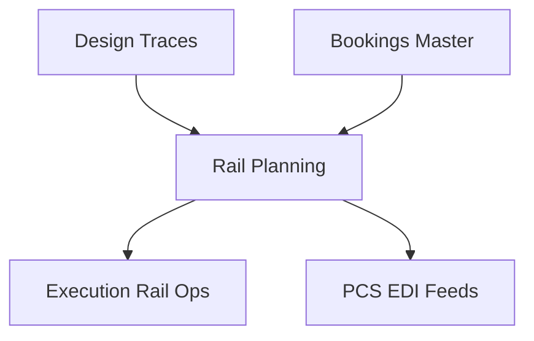

## 1. Overview
**Rail Planning** is the strategic interface for train construction. It provides operators with the tools to translate commercial bookings into technically feasible and safe rail compositions.

## 2. Technical Field Mapping (Elenco Treni)

The departures/arrivals list serves as the primary dashboard for rail coordinators.

### Search & Filters
| Label | HTML Name | Nature | Data Source |
| :--- | :--- | :--- | :--- |
| **Connessione** | `id_connessione` | Select | **Design > Connessioni** |
| **Viaggio Treno** | `pratica` | Text | Unique Trip Identifier |
| **Data Treno** | `data_slot_da/a` | Datepicker | Operational Calendar |
| **Stato Treno** | `stato_pratica` | Select | Hardcoded: Planned, Confirmed |

### Data Grid Columns
| # | Column | Technical Name | Description |
| :-- | :--- | :--- | :--- |
| 1 | **VIAGGIO** | `pratica.codice` | Internal link to the trip record. |
| 2 | **ETD / ETA** | `etd` / `eta` | Scheduled arrival/departure times. |
| 3 | **LUNGH.** | `lunghezza_tot` | Cumulative length of all wagons (meters). |
| 4 | **P. LORDO** | `peso_lordo_tot`| Cumulative gross weight of the train. |
| 5 | **CARRI** | `count(carri)` | Total number of wagons in the consist. |
| 6 | **STATUS** | `status_icon` | System verification checkmark (Green = OK). |

## 3. The "Tetris" View: Loading Logic & Constraints
The core of the module is the **Composition Tool**, where planners perform the following manual and automated tasks:

### Technical Constraints (The Guardrail)
The system enforces several hard constraints during the composition phase:
- **Maximum Train Length**: Pulls from the **DESIGN > Tracce** template. The UI turns red if the combined wagon lengths exceed this limit.
- **Tonnage Limit**: Checks against the traction power of the assigned **Vettore Ferroviario**.
- **The Matrix Check**: Every container placement is validated against the **Compatibility Matrix**.
    - *Y-Axis*: Wagon Type (Intermodal, Pocket, Flat).
    - *X-Axis*: UTI Type (Tank, HC, Bulk).
    - *Result*: Pass/Fail based on profile and structural capacity.

### Automated Validation
The system cross-references data in real-time. If a combination is unsafe (e.g., a heavy tank on a light-axle wagon), the system blocks the assignment with a technical error message.

## 4. Connectivity & Propagation
The Rail Planning module acts as the "Decision Hub" of the lifecycle.

| Target Module | Data Propagated | Purpose |
| :--- | :--- | :--- |
| **EXECUTION** | `carico_treno` | Populates the Loading List and CIM forms. |
| **MONITORING** | `id_viaggio` | Prepares the Track & Trace board for incoming milestones. |
| **PCS** | `COPARN` | Triggers the EDI notification to the port terminals for expected units. |

*   **Inbound**: Pulls technical path limits (Max Weight/Length) from **DESIGN** and asset availability from **GENERALE**.
*   **Outbound**: Confirmed train configurations feed the **EXECUTION** module's manifest generation and trigger data synchronization with **Port Community Systems (PCS)**.
