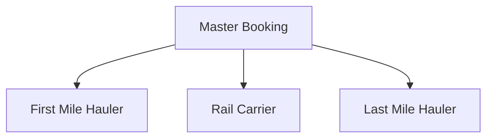

## 1. High-Fidelity Logistics Modeling
The **Booking Form** is the most sophisticated interface in the Magemo suite. It manages the complex transformation of a commercial request into a validated technical mission.

### Technical Constraint Enforcement
The UI prevents operational errors through real-time calculation and validation:

<Frame caption="Intermodal Booking interface with technical validation.">
  
</Frame>

- **Weight Balancing**: Automatically calculating gross weights (Net + Tare) based on equipment selected from the Master Registry.
- **Safety Compliance**: Enforcing **Dangerous Goods (RID/UNDG)** and **CER waste code** mandatory fields.

## 2. Segmented Procurement Orchestration
Magemo breaks every transport mandate into three distinct logical segments, allowing for multi-hauler orchestration:
1.  **First Mile (FM)**: Road/Maritime pickup and terminal delivery.
2.  **Main Transport (TR)**: The primary rail leg.
3.  **Last Mile (LM)**: Final road delivery to the consignee.

Each segment maintains its own vendor assignment, pricing, and execution status while remaining unified under the master Booking ID.

