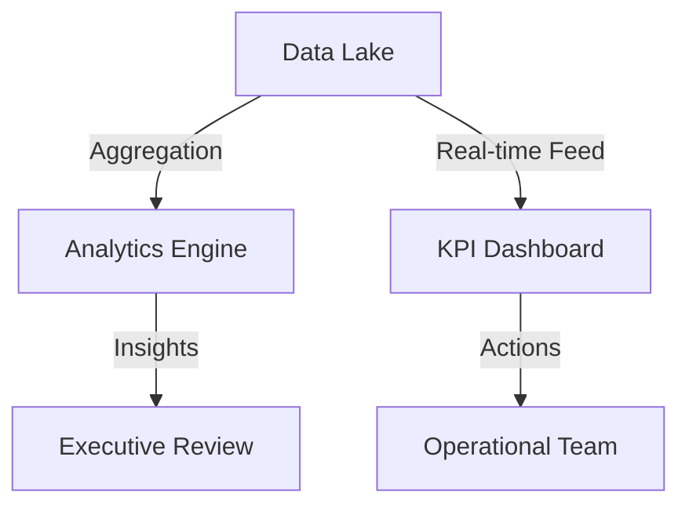

## 1. Analytics & Strategic Reporting
The **Analytics** module (`/analytics`) provides a multi-dimensional view of the network's commercial health.
- **Deep Audit Reports**: Dynamic generation of performance summaries, identifying year-over-year trends in customer volume and service utilization.
- **Client Analysis**: Mapping the geographical and financial footprint of the client base.

## 2. Real-Time KPI Dashboard
The **KPI Dashboard** (`/kpi`) is the operational pulse of the organization.
- **Visual Performance Hub**: Interactive ECharts representing:
    - **Load Factors**: Rail capacity utilization.
    - **Sales Velocity**: Average time from Inquiry to Quote.
    - **Operational Delta**: Variance analysis between planned and actual event timestamps.

