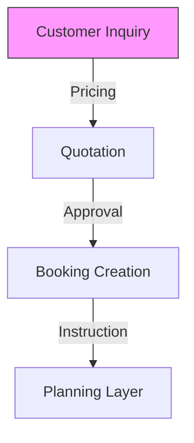

**Commercial Orchestration** manages the entry point of the logistics chain, ensuring that every inquiry is converted into a technically feasible and profitable mandate.

## 1. Customer Relationship Orchestration
Using **CENTRICO**, the system manages the lifecycle of the clientRelationship:
- **Proactive Inquiries**: Converting leads into confirmed transport requests.
- **Role Validation**: Ensuring the customer has the correct commercial standing (Provisional vs. Validated) before enabling booking flows.

## 2. Dynamic Quotation Engine
Orchestrating the margin calculation by combining:
- **Direct Costs**: PUL (Profit per Unit) calculated from the **Design** module's cost archetypes.
- **Market Conditions**: Real-time capacity availability and peak-season surcharges.

## 3. Communication Hub
The orchestration layer centralizes all stakeholder communication, ensuring that quote approvals, booking confirmations, and document rejections are distributed to the correct **Contacts** registry entries.

