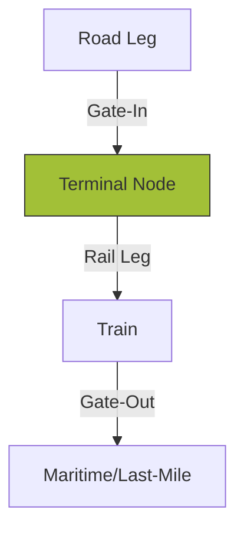

The **Connection Orchestration** layer manages the "Connective Tissue" of the intermodal network, ensuring that rail, road, and maritime legs function as a single, synchronized chain.

## 1. The "Zig-Zag" Flow
Orchestrating non-linear journeys where cargo moves between multiple nodes and transport modes.
- **Interchange Logic**: Defining the rules for how a unit is handed over from a truck to a train, or a train to a vessel.
- **Buffer Management**: Calculating mandatory "Buffer Times" at nodes to prevent minor delays in one leg from collapsing the entire chain.

## 2. Trip Generation Orchestration
Automated creation of operational "Viaggi" (Trips) based on periodic connection templates.
- **Bulk Instantiation**: Generating weeks of operational capacity based on a single connection blueprint.
- **Resource Balancing**: Ensuring that the number of scheduled trips matches the forecasted availability of the rail fleet.

## 3. Cross-Link Visibility
Ensuring that commercial teams in **Centrico** can see the full multi-leg connectivity of a service.
- **Hop-by-Hop Visibility**: Drill-down from a high-level service into the specific traces and hauler mandates that make up the connection.

