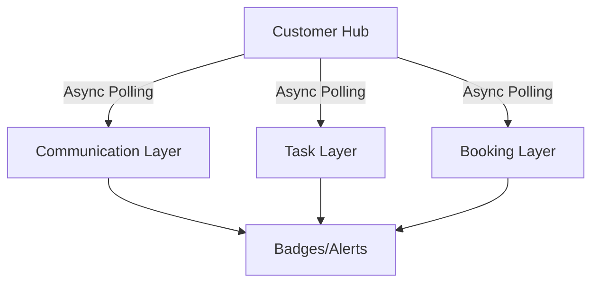

## 1. The Multi-Source Notification Engine
The **Customer Hub** (`/leads`) is designed as a high-density priority queue. Unlike standard CRM directories, it implements a real-time notification engine that breathes life into the data.

### Vertical Status Surfacing
For every customer record, the system performs parallel asynchronous checks across three logical layers:
*   **Communication Layer**: Scans WhatsApp and Email threads for unreplied messages.
*   **Task Layer**: Aggregates pending operational "To-Dos" assigned to the account.
*   **Commercial Layer**: Monitors active "Draft" and "Open" inquiries awaiting a quote.

These status indicators are surfaced as **Smart Badges**, allowing account managers to immediately identify which customers require urgent intervention.

## 2. Integrated Financial Intelligence
The hub provides direct access to the **Deep Report Generator**, which orchestrates data from external and internal sources:
- **Creditsafe Integration**: Real-time financial vetting and risk scoring.
- **Dynamic Scripting**: The system uses specialized scripting helpers to render interactive financial charts and perform custom analysis within the secure report container.

