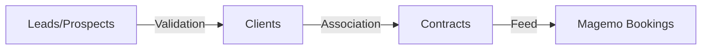

## 1. Holistic Client Management
In CENTRICO, the **Clients** (`/customers`) and **Customers** (`/leads`) interfaces are orchestrated as a single logical layer. 
- **Lead-to-Client Transition**: When a "Prospect" moves to a "Client" status, the system triggers a cascade of updates across the Data Lake, enabling full commercial history tracking.
- **Search Logic**: Autocomplete indexing across multiple databases (`db_ai-loop_CRM_`) to provide instant identity discovery.

## 2. Dynamic Contract Lifecycle
The **Contracts** module (`/gestione-contratti`) manages the legally binding side of the orchestration.
- **Contractual Constraints**: Active contracts are polled during the **Planning** phase to verify agreed-upon rates and service level agreements (SLAs).
- **Automated Renewals**: The system monitors `Termine_Disdetta` (cancellation terms) and alerts the account manager via the **Tasks** module.

<Frame caption="The Dynamic Contract Management interface for creating and auditing commercial agreements.">
  
</Frame>

