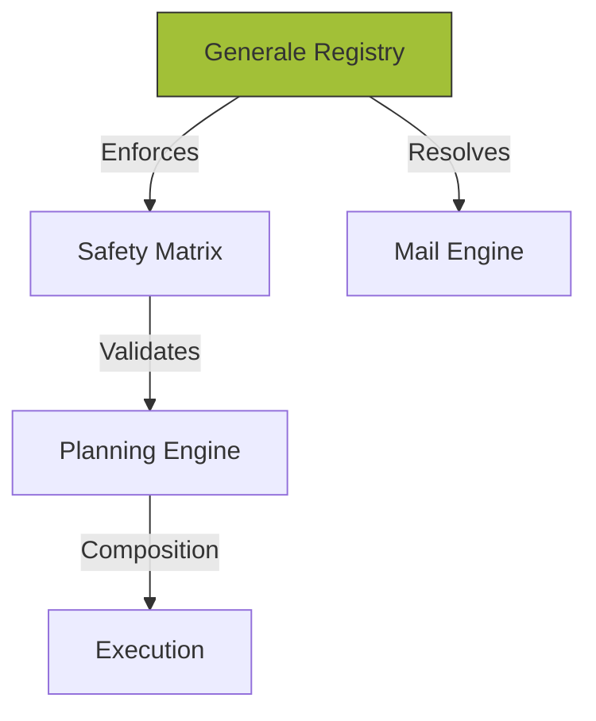

## 1. The Validation Pipeline
The orchestration layer enforces a strict "Source of Truth" policy using the **GENERALE** module as the system's nervous system. 

### Subject Governance (Anagrafica)
A **Soggetto** (Subject) is the primary container for multi-role logistics identities.
- **Categorization Logic**: Checking a box (e.g., *MTO*, *Vettore*, *Terminalista*) instantly updates relevant dropdowns across the platform.
- **Financial Compliance**: Mandatory P.IVA/CF, EORI, and ERP synchronization (e.g., `erp_codice_cliente`) are enforced before commercial actions are permitted.
- **ERP Lifecycle**: The system displays the `Ultimo aggiornamento dati ERP` to ensure planners are working with live credit and status data.

<Frame caption="Subject Management interface showing multi-tab roles and personnel registry.">
  
</Frame>

## 2. Technical Validation Matrix
Magemo uses complex safety rules to ensure physical assets are used legally and safely.

### The Safety Validator
The **Wagon/UTI Compatibility Matrix** is the fundamental rulebook for rail orchestration. 
- **Physical Verification**: No cargo (UTI) can be loaded onto an asset (Wagon) without an explicit "Pass" from this matrix.
- **Field-Level Enforcement**: Validates deck length, number of axles, and loading deck height (Tipi Carro) against UTI ISO dimensions.

## 3. Data Connectivity Lifecycle
Every operational transaction is strictly a pointer to the **Generale** module. This "Single Source of Truth" ensures that a change in a master record—such as updating a node's **UN/LOCODE** or an asset's weight limit—propagates across the **Planning Engine** immediately.

