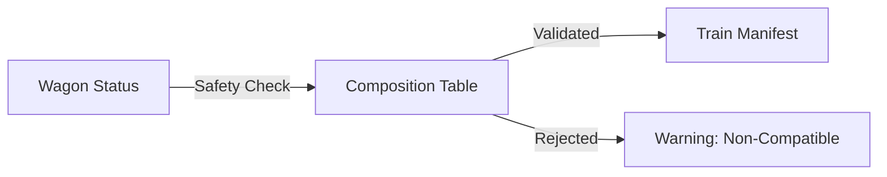

## 1. Wagon Health & Zig-Zag Analysis
The **Fleet Management** dashboard provides a real-time "Health Map" of all rolling stock. Assets are color-coded based on their operational status:
- **Green**: Available and in high technical condition.
- **Yellow**: Due for near-term maintenance or periodic revision.
- **Red/White**: Out of service or requires immediate technical inspection.

<Frame caption="The Zig-Zag fleet dashboard visualizing wagon status across the network.">
  
</Frame>

## 2. The Rail Safety Matrix
One of the most critical orchestration layers is the **Compatibility Matrix**. It physically prevents the assignment of a Loading Unit (UTI) to a Wagon if the parameters (weight, length, geometry) are unsafe.

- **Weight Thresholds**: Automatic blocking if the total mass of the UTI exceeds the load limit of the assigned Wagon type.
- **Dimensional Geometry**: Ensuring that the "Profile" of the container is compatible with the rail trace's clearance limits.

<Frame caption="The technical relationship board between Wagons and Loading Units.">
  
</Frame>

## 3. Asset Relocation Logic
The system analyzes empty wagon positions across all terminals and suggests "Light Runs" to nodes with high predicted demand, optimizing the network's asset utilization.

