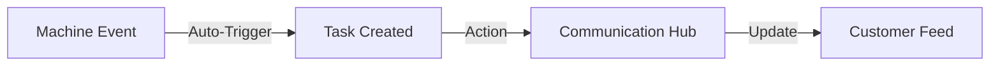

## 1. Multi-Channel Communication Hub
The **Communication** module (`/communication`) is the unified interface for external visibility.
- **WhatsApp & Email Hub**: Real-time orchestration of customer conversations. The system links these threads back to specific **Inquiries** or **Bookings** to maintain full context.
- **Automated Alerts**: System-generated notifications regarding delays or status updates are broadcast through this hub.

## 2. Operational Task Orchestration
The **Tasks** module (`/tasks`) serves as the collective "To-Do" list for the logistics team.
- **Smart Assignment**: Tasks are automatically generated by the state machine (e.g., "Missing Documentation", "Check Late Arrival") and assigned to the relevant department.
- **Priority HUD**: High-priority tasks are surfaced as red badges in the **Customer Hub**, ensuring critical bottlenecks are addressed first.

