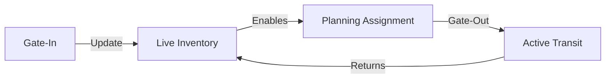

**Inventory Orchestration** ensures that the terminal network has the right equipment in the right place at the right time.

## 1. Network-Wide Balanced View
Real-time visibility into the distribution of **Unità di Trasporto Intermodale (UTI)**.
- **Full vs. Empty Balancing**: Highlighting terminals with an excess of empty units that could be repositioned to nodes with high export demand.
- **Stock Thresholds**: Automated alerts when a terminal node's inventory exceeds its physical shunting capacity.

## 2. Capacity Foresight
Predicting equipment availability for the **Planning** module.
- **Reserved vs. Free Inventory**: Distinguishing between units assigned to active bookings and units available for new commercial mandates.
- **Aging Analysis**: Identifying "Stagnant Stock" (units sitting at nodes for excessive periods) to trigger customer alerts or relocation missions.

## 3. Terminal Gate Orchestration
Synchronizing the physical "Gate-In" of a unit with its digital availability in the **Booking** engine.
- **Instant Availability**: As soon as a truck crosses a geofence and completes Gate-In, the UTI is marked as "Ready to Load" for the next rail connection.

