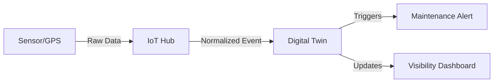

The **IoT Orchestration** layer transforms physical sensors into actionable logistics intelligence.

## 1. Fleet-Wide GPS Polling
Automated aggregation of positioning data from multiple hardware providers (Nexxiot, Savvy, etc.).
- **Provider Neutrality**: The system normalizes telemetry data into a standard "Event" format, regardless of the hardware source.
- **Geofencing Triggers**: Automatic status changes (e.g., *Arrived at Node*) based on GPS coordinates crossing a terminal's virtual perimeter.

## 2. Sensor Intelligence
Orchestrating more than just position:
- **Impact Detection**: Monitoring for G-force spikes during shunting to identify potential asset damage.
- **Condition Monitoring**: Tracking temperature or humidity for sensitive cargo (Reefers/Tanks).

## 3. The Digital Twin
Every physical wagon and UTI has a corresponding digital twin that reflects its live status, technical health, and historical usage patterns.

