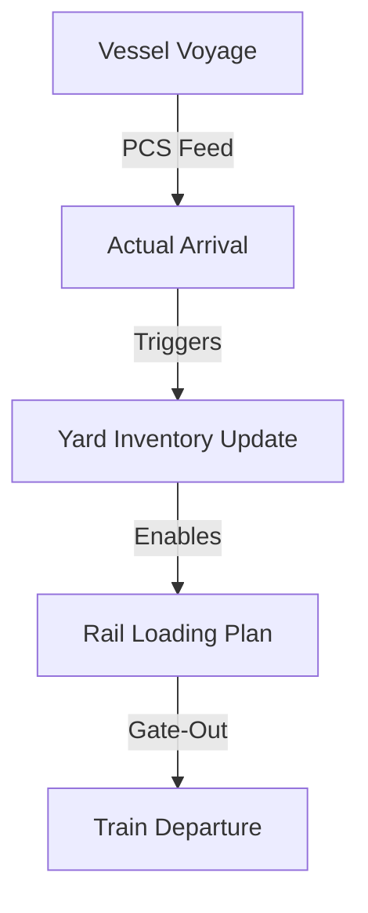

The **Maritime Orchestration** layer manages the interaction between the intermodal network and global shipping lines.

## 1. Vessel & Voyage Registry
Managing high-fidelity ship data to ensure compatibility with port drafts and terminal handling equipment.
- **IMO Tracking**: Unique identification of vessels across the network.
- **Voyage Instances**: Associating maritime travels with specific intermodal connections.

## 2. PCS (Port Community System) Handshakes
The system acts as a bridge between the Port Authority and the inland rail planner.
- **Pre-Arrival Notification**: Automating the communication of units destined for rail loading to the port gate system.
- **Vessel Arrival Updates**: Live feeds of ship docking (ATA) to trigger the "Ready for Loading" status in the **Execution** module.

## 3. Yard & Inventory Sync
Orchestrating the storage of units at port terminals.
- **Free-Time Tracking**: Monitoring the "Demurrage & Detention" clocks to prioritize rail departure for units nearing their free-time limit.

