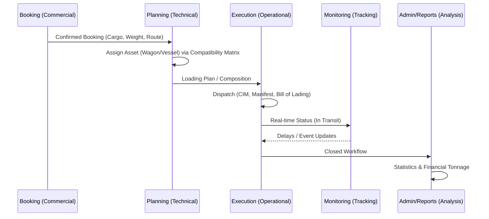

The system architectural modularity allows for the rapid "plug-and-play" of functional units, ensuring that data flows without manual re-entry between departments.

## 1. The Operational Lifecycle
The application tracks the lifecycle of an intermodal transport mandate from commercial agreement to historical record.

## 2. Shared Registry Logic
Ensuring that mandatory master data from the **GENERALE** module is strictly enforced across the chain. 
- **Inbound Dependencies**: Design and Planning pull from **Soggetti** (Customers/Carriers), **Nodi** (Loading Points), and **UTI Types** (Equipment).
- **Outbound Consumer Hubs**: Design becomes Planning when a date slot is assigned; Planning becomes Execution when the physical asset moves; Execution feeds Monitoring via status updates.

<Frame caption="The interconnected logistics network mapping within the Orchestration layer.">
  
</Frame>

## 3. Native Integration Handshakes
- **PCS Gateway**: Direct handshakes with Port Community Systems for maritime arrivals and gate notifications.
- **IM Integration**: Real-time traffic data from Infrastructure Managers for rail path management.
- **Mail Hub**: The `Modelli Mail` system resolves contacts dynamically from the **Contatti** registry based on the **Soggetto** linked to the current booking.
