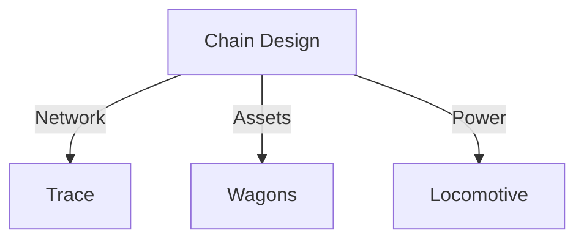

Designing the physical and logical flow of goods requires a deep understanding of network capacity and terminal constraints.

### Trace Engineering
Defining the optimal rail path or maritime route based on:
- **Historical Performance**: Analyzing past transit times to establish realistic schedules.
- **Network Status**: Real-time traffic data from Infrastructure Managers.

### Composition Orchestration
Synchronizing the availability of physical assets:
- **Wagon Allocation**: Matching available fleet with pending bookings.
- **Power Planning**: Ensuring locomotive or vessel capacity is aligned with total train/cargo weight.

<Frame caption="Trace engineering and resource blueprinting.">
  
</Frame>

### Variance Analysis
Real-time delta calculations between planned network schedules and actual asset movements. If a train is delayed at a border crossing, the system recalculates the impact on all downstream connections.

