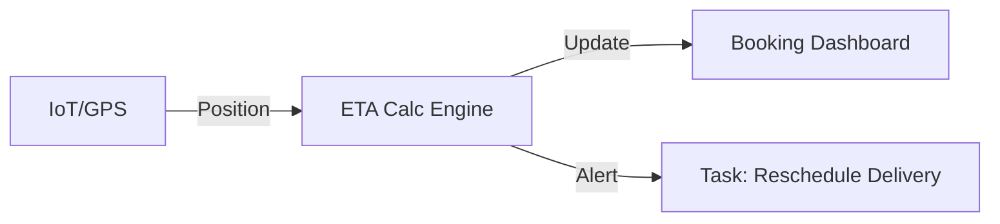

## 1. Geo-Spatial Control Tower
The system aggregates live data from IoT devices and terminal gate systems to provide a unified map of the entire logistics network.

- **Dynamic Geofencing**: Automatic status updates triggered when a wagon or unit crosses a virtual perimeter around a terminal or border node.
- **Micro-Event Tracking**: Detailed logging of internal terminal movements (e.g., *Sbarcato*, *Ricaricato*) through EDI integration.

<Frame caption="Real-time network map showing active traces and asset density.">
  
</Frame>

## 2. Dynamic ETA Orchestration
By consuming real-time positioning from providers like **Nexxiot** and **Savvy**, the orchestration layer recalculates Estimated Time of Arrival (ETA) for subsequent legs of a journey.

- **Delay Propagation**: If a rail leg is delayed, the system sends automated "Warning" tasks to the last-mile trucking partners via the **Tasks** module.
- **Historical Benchmarking**: Comparing actual transit times against the "Ideal" Trace definition to identify structural bottlenecks in the network.

