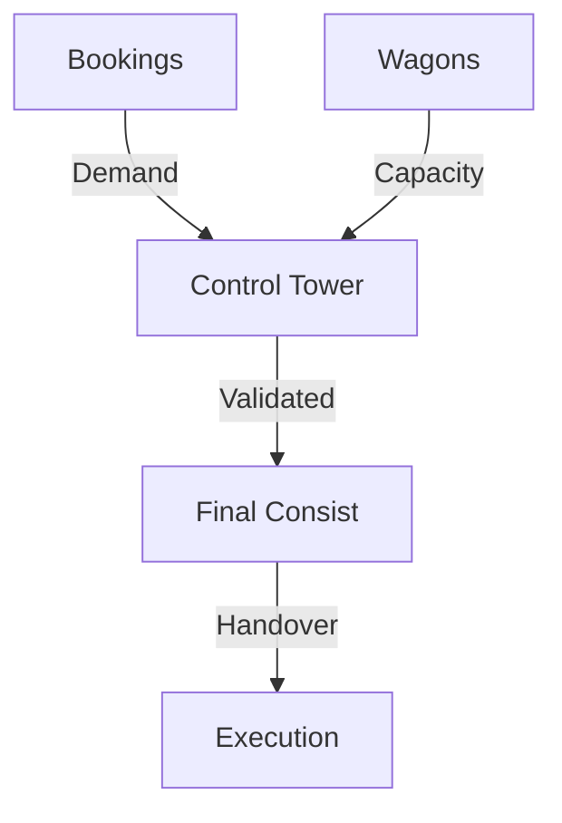

The **Planning Control Tower** is the primary dashboard where technical planners oversee the synchronization between commercial demand and physical capacity.

## 1. Real-Time Resource Overview
A high-density view of upcoming "Viaggi" (Trips) across the entire service network.
- **Loading Progress**: Highlighting the percentage of reserved vs. empty slots for every train.
- **Priority Management**: Identifying urgent bookings that require immediate asset assignment.

## 2. Resource Conflict Management
The orchestration layer automatically flags potential operational failures:
- **Overbooking Alerts**: When the number of confirmed bookings exceeds the physical capacity of the allocated wagons.
- **Asset Delays**: Identifying if the assigned wagons for a departure are currently delayed on an inbound trip, risking a turnaround failure.

## 3. Composition Finalization
The bridge to **Execution**.
- **Consist Validation**: Before a train can be handed over to dispatch, the Control Tower ensures all units are technically compatible and all dangerous goods (RID) are correctly placed.

