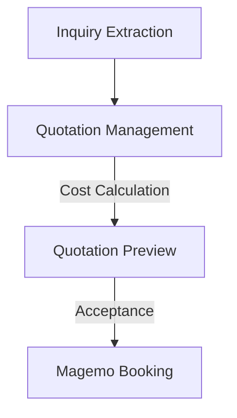

## 1. Multi-Step Quotation Management
The **Quotation Management** module (`/quotation-management`) orchestrates the commercial response to complex multimodal requests.
- **Request Ingestion**: Links an `Inquiry` to a `req_ID`, creating a working container for cost calculation.
- **Scenario Comparison**: Planners can model multiple transport options (e.g., Road vs. Rail) within the same quote to present the most cost-effective solution.

<Frame caption="The Quotation Management interface for calculating costs and managing service requests.">
  
</Frame>

## 2. Interactive Quotation Preview
The **Preview** module (`/quotation-preview`) ensures that the final output is commercially polished and technically accurate.
- **Live Markdown Rendering**: Generates a professional PDF/HTML view of the quote, including terms, conditions, and route visuals.
- **Operational Link**: Once a quote is accepted, it triggers the automatic creation of a **Booking** in the Magemo layer.

<Frame caption="Real-time Quotation Preview with professional document generation.">
  
</Frame>

