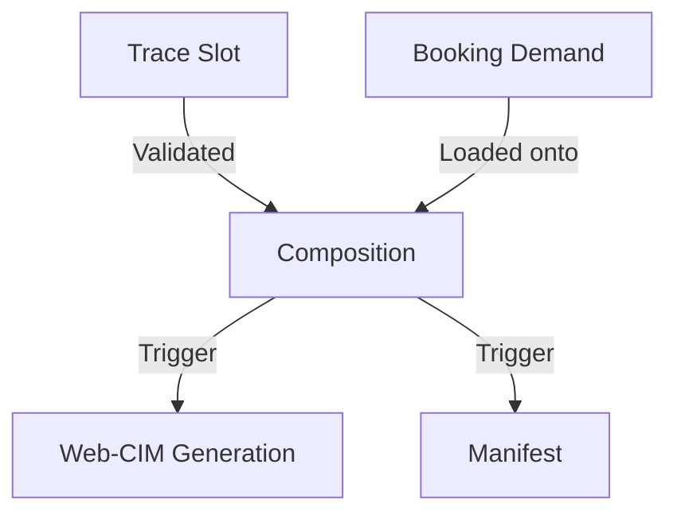

The **Rail Orchestration** layer is the technical core of the intermodal network, managing the complex relationship between physical assets, railway tracks (traces), and commercial demand.

## 1. Trace & Slot Management
The system orchestrates rail traces as "Time-Space Slots".
- **Dynamic Slot Assignment**: Associating a specific service date with a validated railway trace.
- **Path Calculation**: Ensuring that the assigned trace covers all mandatory nodes (Terminals, Borders) defined in the **Design** blueprint.

## 2. Train Composition Governance
The orchestration engine validates every wagon placement in real-time.
- **Shunting Logic**: Automating the "Muta" (technical set) assignments to minimize terminal handling time.
- **Safety Checks**: Cross-referencing wagon technical specifications against total train length and weight limits provided by the Infrastructure Manager (IM).

## 3. Web-CIM & Documentation
Automating the generation of international rail documents:
- **CIM Generation**: Direct data push from the **Execution** list to official railway carrier formats.
- **Manifest Orchestration**: Consolidating all units on a train into a single digital manifest for border authorities.

