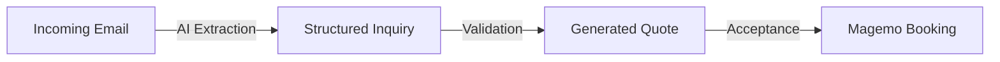

## 1. Inquiry Lifecycle & AI Extraction
The **Inquiry Module** is the gateway to the Magemo ecosystem. To accelerate the "Sales-to-Ops" transition, we implemented the **AI Inquiry Assistant**.

### NL-to-Structure Mapping
Using specialized Natural Language Processing (NLP) models, the assistant analyzes unstructured inputs (emails, chat logs, notes) to automatically extract:
*   **Logistics Nodes**: Recognizing origins and destinations.
*   **Commodity Data**: Identifying types of goods and dangerous goods (ADR/RID).
*   **Temporal Constraints**: Extracting requested delivery windows.

## 2. Commercial Funnel Orchestration
The system tracks the transition of inquiries through an immutable state machine:
`DRAFT -> REVIEW -> QUOTED -> CLOSED`

Every state transition is recorded as a standard operation in the **Data Lake**, providing management with high-fidelity "Sales Velocity" analytics through the standard Funnel View.

