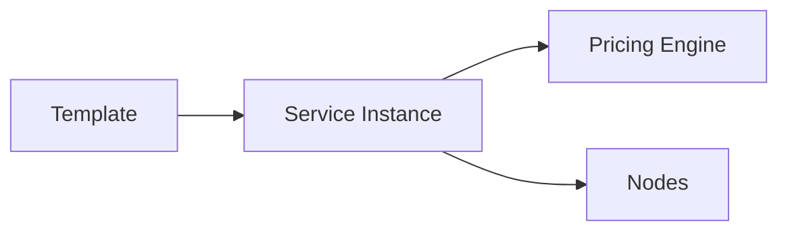

Through the Orchestration layer, users can define complex multi-modal service products with granular precision. This includes:

### Commercial Templates
Pre-defined service rotations that can be instantiated with a single click. These templates encapsulate the standard operational path, baseline costs, and required resources.

<Frame caption="The Service Management interface for defining new multi-modal offerings.">
  
</Frame>

### Dynamic Pricing Models
Integration with **CENTRICO's** quotation management to provide real-time cost-to-serve analytics. This allows commercial teams to adjust margins based on live operational data from the Data Lake.

### Node-to-Node Blueprinting
High-fidelity mapping of terminals, border crossings, and shunting zones. Each node is enriched with technical constraints (e.g., maximum train length, shunting hours) to ensure service designs are physically feasible.

