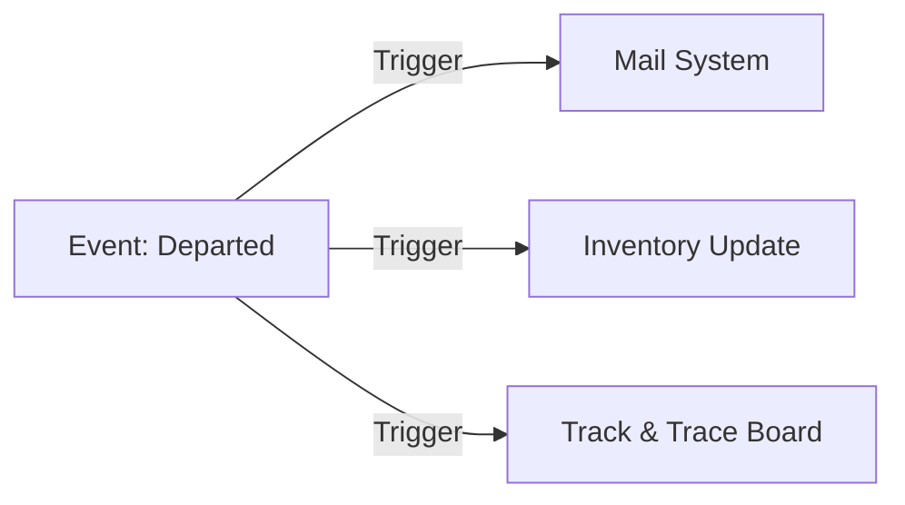

## 1. Composition & Shunting Orchestration
In the **Rail Execution** layer, planners translate the digital booking list into a physical train consist.
- **Composition Planning**: Drag-and-drop assignment of bookings to wagon slots, governed by the real-time **Compatibility Matrix**.
- **Resource Locking**: Successfully assigned assets are marked as "In Use" across the registry to prevent double-booking.

<Frame caption="Train Composition board for technical rail execution.">
  
</Frame>

## 2. Global Event Propagation
Operational events (e.g., *Loaded*, *Departed*, *Arrived*) are not just data entries; they are **System Triggers**.
*   **Customer Notifications**: Every milestone update triggers the `MAGEMO_MAIL_MODELS` to send custom-branded status updates to stakeholders.
*   **Inventory Shifts**: A "Departed" status automatically moves units from the "Terminal Inventory" to the "Transit Ledger".

## 3. Inventory Balancing (Relocation)
The system provides a real-time balance of **Full vs. Empty** units across all nodes. This allows for automated "Relocation flows," suggesting the repositioning of empty equipment to node hubs with predicted high demand.

