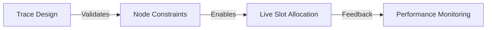

**Trace Orchestration** is the strategic process of designing physical rail paths that maximize speed while respecting infrastructural bottlenecks.

## 1. Trace Blueprinting
Designing the "Golden Path" for intermodal rotations.
- **Node-to-Node Precision**: Defining mandatory stops for customs, loco-swaps, and terminal handling.
- **KM Efficiency**: Calculating the shortest viable distance across the European rail network to reduce fuel and track-access billing.

## 2. Dynamic Slot Allocation
Orchestrating the transition from a static trace design to a live, date-specific operational slot.
- **IM Synchronization**: Integrating with Infrastructure Managers to verify that a designed trace is available for the required date/time.
- **Conflict Resolution**: Identifying trace overlaps that could cause terminal congestion or late departures.

## 3. Performance Baselining
Every trace acts as a benchmark for the **Monitoring** module.
- **Ideal vs. Real**: Establishing the "Ideal Transit Time" which allows for real-time delay alerts when a train deviates from its orchestrated path.

