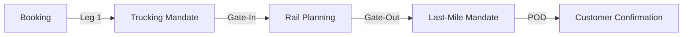

Road transport serves as the "Capillary" layer of the network, connecting deep-sea ports and rail terminals to the final customer site.

## 1. Digital Mandate Orchestration
The system automates the assignment of trucking legs to pre-validated road partners.
- **Mandate Generation**: When a booking is finalized, the system generates a "Transport Mandate" containing pickup/delivery windows and unit technical data.
- **Carrier Portals**: Haulers receive mandates through a dedicated interface, reducing manual communication (Email/WhatsApp).

## 2. Milestone Tracking
Orchestrating the transition points between road and rail.
- **Gate-In/Gate-Out Events**: Automatic status updates when a truck enters or leaves a terminal node.
- **POD (Proof of Delivery)**: Digitization of delivery notes and arrival timestamps, immediately visible to the commercial team in **Centrico**.

## 3. Road-Rail Synchronization
The orchestration layer identifies bottlenecks in first-mile arrival that might impact train departure slots.
- **Lateness Propagation**: If a truck is delayed, the **Planning** board highlights the "At Risk" unit on the train composition.

