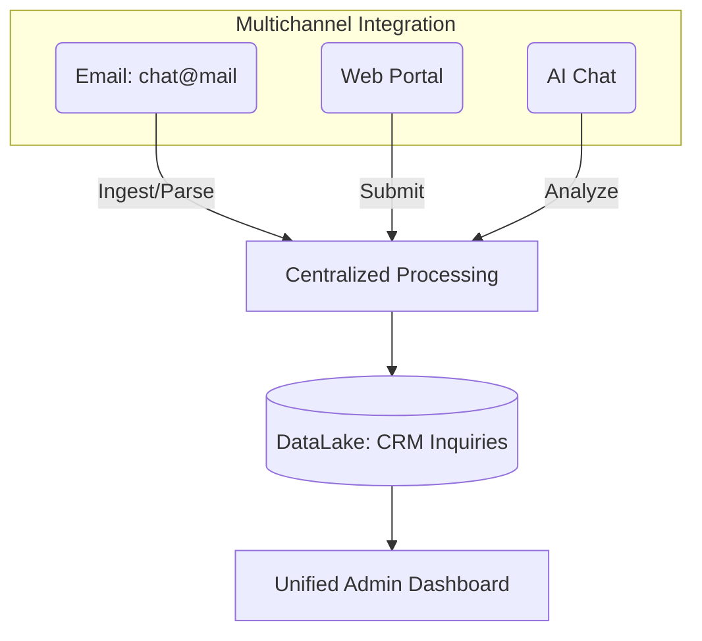

## 1. Overview

**Multichannel Communications Management** ensures that the platform receives, processes, and centralizes customer interactions from diverse touchpoints. This deliverable fulfills the requirement to "support superior management of customer communications via multiple channels," ensuring a consistent experience regardless of whether a customer interacts via email, AI chat, or the web portal.

## 2. Scope and Business Meaning

Functionally, this deliverable covers the **unified ingestion and centralization** of communication. It ensures:
*   **Channel Agnosticism**: Customers can interact via their preferred medium (Email, Chat, Portal).
*   **Centralized Truth**: All interactions, regardless of source, are stored in a single system (`db_ai-loop_CRM_Inquiries`).
*   **Consistent Experience**: The internal processing workflow remains identical for all channels, ensuring consistent response quality.

## 3. Implemented Functionalities

The platform implements the following functionalities to fulfill the "multichannel management" requirement.

### Unified Ingress Architecture
**Requirement Addressed**: *"Communications via multiple channels (email, web portal, chat)"*

The platform routes all communication channels into a single ingestion pipeline:
*   **Email**: Direct mapping of `chat@mail.wavecentric.ai` to the Inquiry system.
*   **Inquiry Form (Web Portal)**: Structured forms for high-fidelity data capture. [Access here](https://ai-loop.alpeadria.com/inquiry)
*   **AI Chat**: Interactive conversational agents for unstructured guidance. [Access here](https://ai-loop.alpeadria.com/ask-ai)
*   **Reference**: [Service Inquiry](/functionalities/service-inquiry)

### Centralization Diagram
**Requirement Addressed**: *"Centralizing all information in a single system"*

The following visualization demonstrates how multiple channels converge into the centralized DataLake.

## 4. Technical Enablement

The platform enables this deliverable through the following technical components:

### Ingress Points
*   **SMTP Gateway**: Listens on `chat@mail.wavecentric.ai` and triggers the `submit-inquiry` logic via webhook.
*   **API Gateway**: Exposes public endpoints (`/api/public/chat`, `/api/public/submit-inquiry`) for web and chat clients.

### Data Normalization
*   **Unified Schema**: All data, whether parsed from an email body or submitted via a form, is normalized into the `CRM_Inquiries` schema (Standardized JSON payload).
<Frame caption="The AI Loop Inquiries Dashboard interface centralizing multichannel requests.">
  
</Frame>

## 5. Evidence of Delivery

The following evidence demonstrates strict compliance with the CCM 05 requirement:

| Capability | Verification Evidence |
| :--- | :--- |
| **Email Channels** | **Evidenced by [Service Inquiry]**: The configured ingress address `chat@mail` successfully routes external emails into the CRM system. |
| **Portal/Chat Channels** | **Evidenced by [New Inquiry Screens]**: The active availability of the "New Inquiry" (Form) and "AI Assisted" (Chat) interfaces demonstrates the web-based channels. |
| **Centralization** | **Evidenced by [Inquiries Dashboard]**: The dashboard visualizes the centralized repository, aggregating requests from all sources into a single operational view. |

