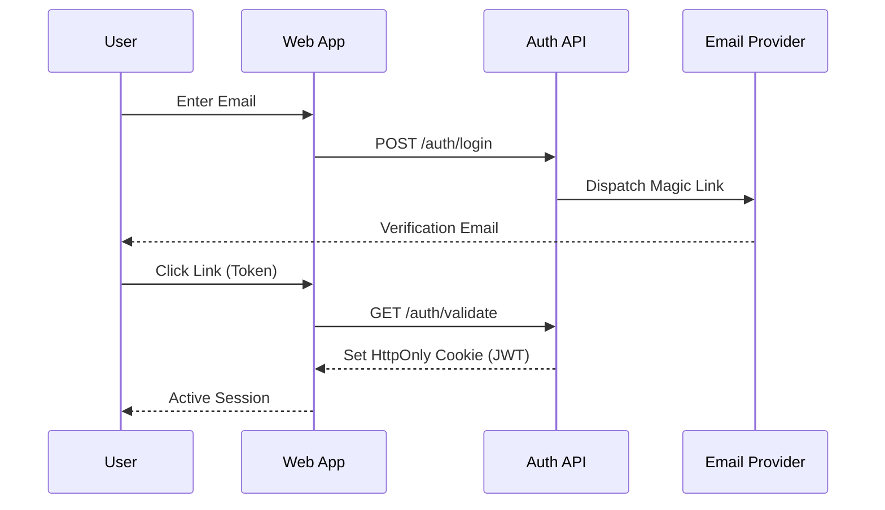

AI Loop uses a strictly passwordless, magic-link based authentication system for enhanced security.

## Login Flow

<Steps>
  <Step title="Request Login">
    User enters their email address.
  </Step>
  <Step title="Magic Link Sent">
    System validates the user and sends a verification link via email.
  </Step>
  <Step title="Verify & Session">
    User clicks the link, which hits the validation endpoint and sets a secure HTTP-only cookie (`jwt`).
  </Step>
</Steps>

## Security

*   **Token Expiry**: Magic links are short-lived.
*   **Cookie**: The session token is stored in a `HttpOnly` cookie to prevent XSS.

## APIs

<CardGroup cols={2}>
  <Card title="Login Request" icon="right-to-bracket" href="/api-reference/authentication/login">
    Request a magic link.
  </Card>
  <Card title="Get Profile" icon="id-card" href="/api-reference/user-profile/get-me">
    Retrieve current session user.
  </Card>
</CardGroup>
