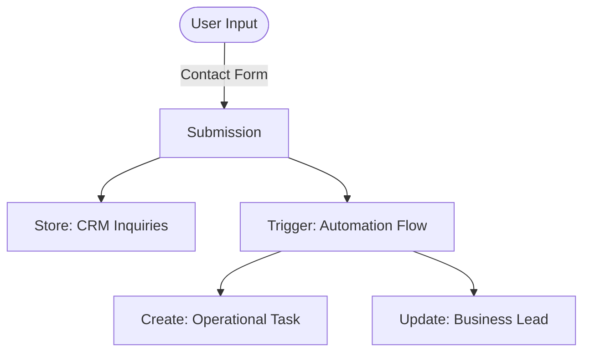

The **General Inquiry** workflow orchestrates the process of handling user inquiries submitted through the contact form, ensuring they are captured in the CRM and processed for follow-up.

## Workflow Visualization

## Step-by-Step Execution Flow

<Steps>
  <Step>
    ### 1. Contact Data Collection & Storage
    The workflow begins with the user filling out the form in the Contact tab.
    
    *   **Interface**: [Contact Us Form](/functionalities/customer-support)
    *   **Input**: User details and message (Name, Email, Subject, Message).
    *   **Endpoint**: `POST /api/public/submit-contact`
    *   **Storage**: Validated data is immediately stored in `db_ai-loop_CRM_Inquries`.
  </Step>

  <Step>
    ### 2. Automation Execution
    Upon submission, the system routes the request to the automation engine for business processing.

    *   **Endpoint**: `POST /api/v1/flows/execute-command`
    *   **Flow ID**: `X5BKUN4qCngsDWpu28SyJ`
    *   **Actions Executed**:
        1.  **Task Creation**: Generates a follow-up task in `db_ai-loop_V3_Tasks`.
        2.  **Lead Update**: Updates the relevant business record in `db_ai-loop_V3_business`.
  </Step>
</Steps>

## Key Outputs

At the completion of this workflow, the following artifacts are generated:

<CardGroup cols={2}>
  <Card title="CRM Record" icon="database">
    **db_ai-loop_CRM_Inquries**
     Full inquiry details stored upon submission.
  </Card>
  <Card title="Business Lead" icon="building">
    **db_ai-loop_V3_business**
     Updated lead information via automation.
  </Card>
  <Card title="Operational Task" icon="list-check">
    **db_ai-loop_V3_Tasks**
     Task assigned for sales/support follow-up.
  </Card>
</CardGroup>

## APIs Involved

<CardGroup cols={2}>
  <Card title="POST /submit-contact" icon="paper-plane" href="/api-reference/public/submit-contact">
    Handles the contact form submission.
  </Card>
  <Card title="POST /execute-command" icon="bolt" href="/api-reference/flows/execute">
    Triggers the automation flow (`X5BKUN4qCngsDWpu28SyJ`).
  </Card>
</CardGroup>
