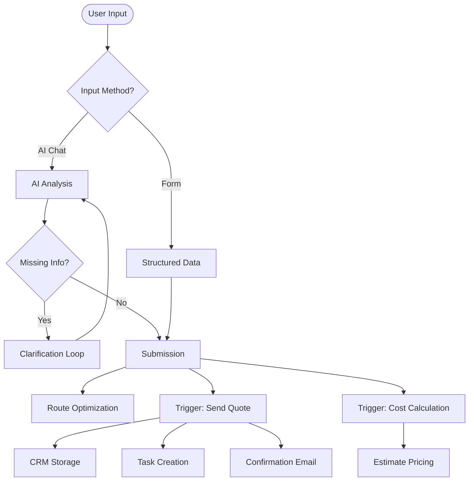

The **User Inquiry** workflow orchestrates the entire lifecycle of a logistics quote request—from initial user input to CRM entry and automation triggers.

## Workflow Visualization

## Step-by-Step Execution Flow

<Steps>
  <Step>
    ### 1. Inquiry Data Collection
    The workflow begins with user input via one of two channels.
    
    **Path A: AI Assistant (Unstructured)**
    *   **Interface**: [AI Assisted Inquiry](/functionalities/new-inquiry-ai-assisted)
    *   **Input**: Free-text (e.g., *"Ship 20ft container from Shanghai to Koper"*).
    *   **Process**: AI parses text to extract schema fields.
    *   **Decision Point**: 
        *   *If data missing* → **Clarification Loop** (System asks follow-up questions).
        *   *If data complete* → Proceed to Submission.
    *   **Endpoint**: `POST /api/public/chat`

    **Path B: Standard Form (Structured)**
    *   **Interface**: [Standard Inquiry](/functionalities/new-inquiry)
    *   **Input**: Validated form fields (Origin, Destination, Goods, Service).
    *   **Process**: Direct validation against schema.
    *   **Result**: Immediate progression to Submission.
  </Step>

  <Step>
    ### 2. Submission & Route Scanner
    Upon validation, the system performs immediate logistics calculations before handing off to the automation engine.

    **Immediate Actions:**
    *   **Endpoint**: `POST /api/public/submit-inquiry`
    *   **Route Optimization**: 
        *   Calls [Route Scanner](/api-reference/public/route-scanner) to calculate optimal path and distance.
        *   *Output*: Injected into the automation payload.
  </Step>

  <Step>
    ### 3. Dual Automation Triggers
    The system triggers **two parallel automation flows** to handle business logic.

    **Endpoint**: `POST /api/v1/flows/execute-command`

    ### A. Send Quote Flow
    **Responsibility**: Customer Engagement & Data persistence.
    
    *   **Flow ID**: `pYmNCmrDNyS9pxyCmasuk`
    *   **Actions Executed**:
        1.  **CRM Storage**: Saves record to `db_ai-loop_CRM_Inquiries` (Lead).
        2.  **Task Creation**: Generates follow-up task in `db_ai-loop_V3_Tasks`.
        3.  **Confirmation Email**: Sends "We received your request" email to user.

    #### B. Cost Calculation Flow
    **Responsibility**: Internal Pricing Logic.
    
    *   **Flow ID**: `H32euZDGg3i3vD8TdEfsx`
    *   **Actions Executed**:
        1.  **Pricing Engine**: Calculates estimated logistics costs based on route/goods.
        2.  **Internal Update**: Updates the inquiry record with cost data.
  </Step>
</Steps>

## Key Outputs

At the completion of this workflow, the following artifacts are generated:

<CardGroup cols={2}>
  <Card title="CRM Record" icon="database">
    **db_ai-loop_CRM_Inquiries**
     Full inquiry details with 'Lead' status.
  </Card>
  <Card title="Operational Task" icon="list-check">
    **db_ai-loop_V3_Tasks**
     Task assigned for sales follow-up.
  </Card>
  <Card title="User Communication" icon="envelope">
    **Email Dispatch**
     Confirmation email sent via automation flow.
  </Card>
  <Card title="Cost Calculation" icon="calculator">
    **Internal Pricing**
     Estimated shipment cost attached.
  </Card>
</CardGroup>

## APIs Involved

<CardGroup cols={2}>
  <Card title="POST /chat" icon="webhook" href="/api-reference/public/chat">
    AI analysis and data extraction.
  </Card>
  <Card title="POST /submit-inquiry" icon="paper-plane" href="/api-reference/public/submit-inquiry">
    Main submission & trigger initiator.
  </Card>
  <Card title="POST /route-scanner" icon="route" href="/api-reference/public/route-scanner">
    Logistics path calculation.
  </Card>
  <Card title="POST /execute-command" icon="bolt" href="/api-reference/flows/execute">
    Triggers "Send Quote" & "Cost Calc" flows.
  </Card>
</CardGroup>
