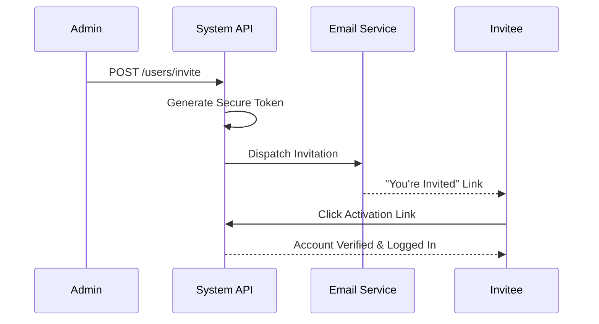

Admins can invite new users to the platform via a secure email flow.

## Invitation Steps

1. **Admin Action**: Admin enters email and permission level (e.g., `admin`, `guest`) in the dashboard.
2. **Token Generation**: A secure, time-sensitive magic link is generated.
3. **Email Delivery**: The user receives a branded "You've been invited" email.
4. **Account Activation**: Clicking the link verifies the email and logs the user in.

<Note>
  Only users with `admin` permissions can initiate this workflow.
</Note>

## API Reference

<Card title="Invite User" icon="envelope" href="/api-reference/users/invite">
  Trigger an invitation email.
</Card>
